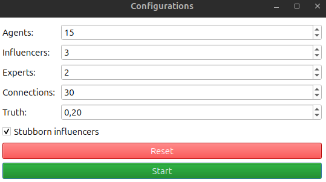
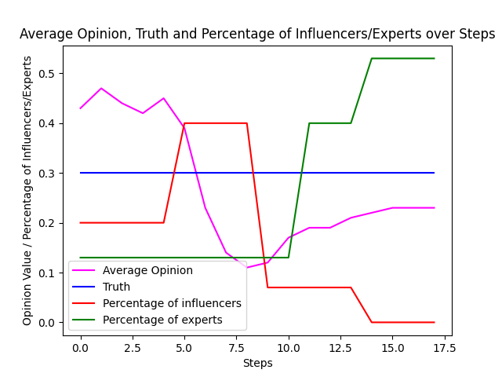
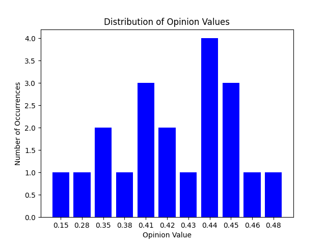
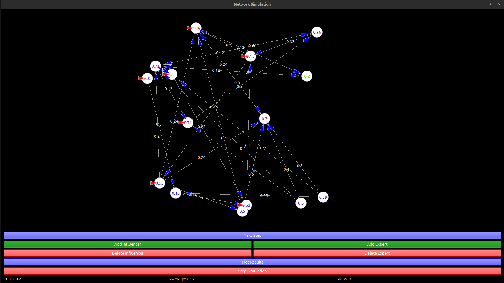
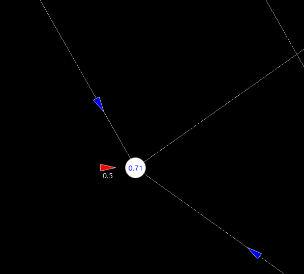
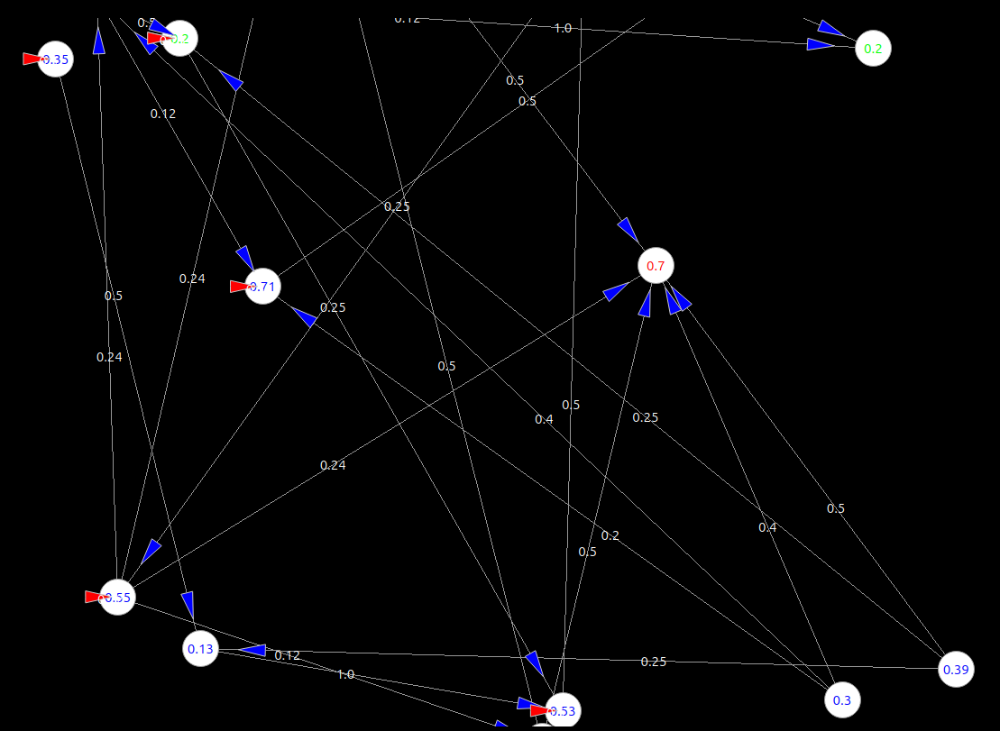
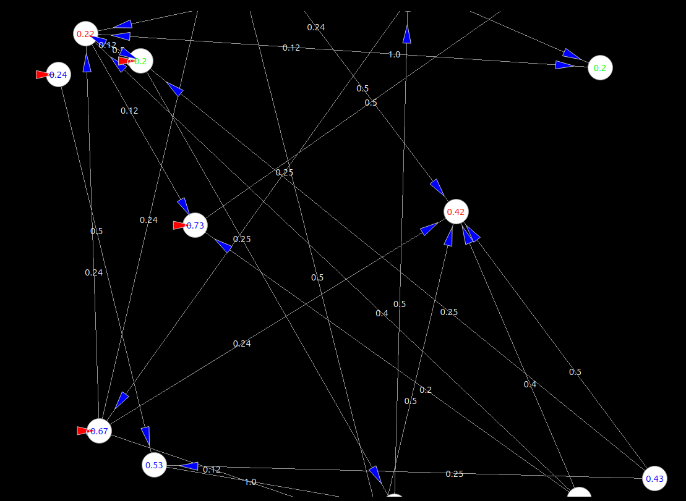

# PyQt-based Simulation of Social Networks
## User Configuration Opions
The social network model underlying the simulation is based on the DeGroot model. First of all the user has to configure the network of agents used within the simulation. First of all the user needs to decide how many agents will participate in the simulation. This number has to be in between 0 and 50. A proportion of this number of agents can be influencers or experts. So in the example shown below the network is a group of 15 agents. Three of these agents are influencers and two experts. An agent can either be a classical agent, an influencer or an expert. But an agent can't be both - an influencer and an expert - at the same time. An agent is either an agent, an influencer or an expert. What differs an influencer from an expert or a normal agent will be described later. Besides from setting the amount distribution of agents the user has to set the overall number of connections used in the network. In the example shown below there are overall 30 connections between the group members. As described later, this number will increase due to the influencers. The simulation can handle up to 100 connections. The truth is the equivalent of DeGroots unknown value of $\theta$ and has to be a value between zero and one, including both edges. Lastly the user has to decide whether the influencers are stubborn or not. In other words, the user has to set if the influencers change their opinion over time or whether they retain the same opinion value throughout the whole simulation. <br><br>
 <br><br>
## The Simulation Window
The user can reset all values back to zero and uncheck the check box by clicking the *Reset* button or start the simulation by hitting *Start*. The actual simulation window is shown below. First, the functionality of the buttons will be explained. As shown below there are multiple ways to interact with and change the simulation during runtime. The graph always represents a snapshot of the network after step x. The current step is shown on the right lower corner. By clicking *Next Step* the user triggers the simulation to calculate all values for the next step and update the shown graph. This will change the agents opinions as well as the average value, which is shown on the bottom of the simulation window. If the user wants to add a new influencer or expert, he can achieve this by clicking the corresponding green buttons. This will add a new influencer or expert to the network as well as his or her new connections. Of course this action will update the printed average value. Where exactly in the network a new influencer or expert is added happens random. As long as there are still influencers or experts in the group the user can delete an influencer or expert as well as his or her connections by clicking *Delete Influencer* or *Delete Expert*. It isn't possible to target a specific agent to be deleted. The simulation deletes these agents which are part of the simulation for the longest time. If the user wants to plot the progression of the average opinion in the course of the current simulation, he can press *Plot Results*. This is possible at any time and thus multiple times during the simulation. Clicking this button will result the two plots that are displayed below. The first graph shows the average group opinion (magenta), the percentage of influencers (red) and of experts (green) in relation to the total group at beginning of the simulation and the actual truth (blue) over the course of steps. The second graph displays the distribution of different opinion values. E.g. in this example four agents had an opinion value of 0.44.<br><br>
 <br><br>
 <br><br>
The user can stop the simulation by clicking *Stop Simulation*. In summary the user can trigger the next step of the simulation, add or delete influencers or experts and plot the progression of the average opinion.<br><br>
 <br><br>
Now it is time to look at the network graph itself. The figure above can serve as an illustration. First of all it should be mentioned that it is possible to zoom in and out of the graph. Each agent is represented by a white circle which contains the opinion value of the agent. The opinion value is determined randomly and lies between zero and one inclusive. A blue value means that the agent is a normal agent, a red value represents an influencer and a green one an expert. The agents weight other agents opinions differently. An arrow from agent A to agent B means that agent A listens to the opinion of Agent B with the weight which is printed in the middle (40\% of the arrow length) of the arrow. A red arrow with a white number below symbolizes that an agent weights his own opinion to some degree. This is illustrated in the following figure, where the agents assigns his or her own opinion a weight of 0.5. <br><br>
 <br><br>
How are the weight values calculated? Mostly the are just divided equally. So if an agent listens to four other agents he or she will weight each of their opinions with factor 0.25. The same would be the case if the agents would listen to three other agents and his or her own opinion. The only exception here are influencers. An agent assigns double the value to the opinion of an influencer. So if an agent listens to three other agents from which one is an influencer he or she will weight he opinion of the other to agents with factor 0.25 each and the influencer's opinion with 0.5. This scenario applies to the agent on the lower right corner of the following figure who has an opinion value of 0.39 and weights the opinion of the influencer above him, which is currently 0.7, with 0.5. <br><br>
 <br><br>
How will this opinion of $F_0 = 0.39$ change after one simulation step? According to the already described DeGroot Model the following applies: $F_1 = 0.25 * 0.13 + 0.25 * 0.2 + 0.5 * 0.7 = 0.4325 $ Here 0.13 and 0.2 are the opinion values of the two agents, which the agent listens to with weight 0.25 and 0.7 is the opinion value of the influencer the agent listens to with weight 0.5. The simulation rounds to two digits after the decimal point. So the agent's new opinion value should be 0.43, as illustrated in the figure below. In this example the value of the agent's opinion changed from 0.39 to 0.43 over the course of one iteration. The bad influence of the influencer led to the agent's opinion to deviate further from the truth of 0.2 although the agent was listening to an expert as well. Relationships of this kind will be examined in more detail later in the paper. Of course the opinions of the surrounding agents have changed as well. The weights, that an agent assigns other agents, won't change over time except for the case that an agent listens to a new created influencer or expert. In this case the assigned weight of each connection will be updated according to the above described principle. <br><br>
 <br><br>
## Influencers
After explaining the basic functionality of the simulation it is time to outline the specific properties of influencers and experts. As already mentioned, one special capability of an influencer is that other agents including influencers and experts, assign double the value to their opinion. This is due to the fact that influencers are, as their name suggests, very good at influencing other people. Because of this the agent with opinion 0.39 in one of the above figures values weights the opinion of the influencer with opinion 0.7 with 0.5 instead off 0.25 as he does with the other two agents. Also it is typical for influencers to have a lot of followers. According to \cite{peopleInsta} there are approximately two billion monthly active users on Instagram in 2025 worldwide. If we look at the top ten most followed Instagram accounts worldwide, we see that the most popular one is that of Christiano Ronaldo with around about 652 million followers. The tenth biggest is Justin Biber's with approximately 294 million followers \cite{topInf}. If we calculate the average follower number of these top ten accounts, we get an average follower number of 400.4 million followers. 400 million are 20\% of the two billion worldwide monthly active Instagram users. Summarized the average follower number of a top ten Instagram account is about 20\% off all monthly active Instagram users. Because of this an influencer in this simulation has at least 20\% of all agents as followers. So if there are e.g. overall 20 agents ,including influencers and experts, part of the group an influencer has at least $0.2 * 20 = 4$ followers. Conversely, this means that normal agents and experts have at most three followers in this scenario. Otherwise they would be influencer. In the figure above the influencer with opinion 0.7 has five followers which are about 33\% of all participating agents. It wouldn't be accurate to say that all influencers have exactly 20\% of all agents as followers. Because of this the simulation works as follows. First of all, every agent including influencers is assigned random connections, whereby the numbers of maximum possible followers is less than 20\% of all agents. On top of this random connections every influencer is assigned new connections afterwards. Each influencer is assigned the amount of 20\% of all agents as new followers additionally. As a result all influencers have more than 20\% of all agents as followers but not every influencer has the exact same number of followers. Influencers affect other people's opinions. But how are they themselves being influenced by other agents? Here the simulation offers two different possibilities. If the \textit{Stubborn influencers} check box of the config window is checked, all influencers stick with their opinion during the whole simulation process. They don't care for the opinion of any other agent. Although they are listening to other agents, they won't update their own opinion value. Conversely they update their opinion in dependence of other agents if the check box of the config window isn't checked. But while normal agents can be influenced completely by other agents, influencers always assign their own opinion a weight of at least 50\%. E.g. if an influencer listens to two agents, he or she assigns a weight of 25\% to each of these agents values and 50\% to his or her own opinion.
## Experts
All in all influencers have a lot of followers and people tend to weight their opinions more. Both isn't the case for experts. In the same way as normal agents experts have less than 20\% off all agents as followers and others don't value their opinions in any special way. But experts have one special capability: they know the truth and they stick with it. This means that experts know the true value from beginning on and they won't change their opinion over the course of steps. In other words you could say that all experts are very wise but also very stubborn. In the example above the truth value is 0.2. Because of this all experts (green agents) in the simulation window have an opinion of 0.2. As you can see in the transition between two simulation steps, as displayed above, the experts stick with this value of 0.2 although the agents surrounding them are changing their opinion. In conclusion experts are normal agents except that they know the truth and don't update their opinion ever. Due to this they have the capability to influence their environment positively regarding finding the truth. With the basic functionality of the simulation model established, the actual analysis can now begin. The following work can be divided in four sections. Initially it will be analyzed how the ratio of agents to connections affect the opinion development over time. What are the key differences between a group with less and with more connections between its members? Are there any differences regarding finding a consensus? The second section tries to understand the role of experts in regard of leading the group to the truth. How successful can they be and can they achieve any long lasting effects? Afterwards the third section will investigate the role of influencers on this dynamic. How can influencer affect the development of opinions within the group. Do they lead agents away from the truth? Can influencers lead to greater polarization or stronger consensus? Is there a negative impact if the influencers are stubborn? The fourth and last part of the simulation experiment combines sections two and three and tries to confirm especially the negative impact of stubborn influencers. 

## Requirements:
* Python3
* PyQt5
* numpy module
* matplotlib module
* random module

Run ```main.py``` to start the program.
